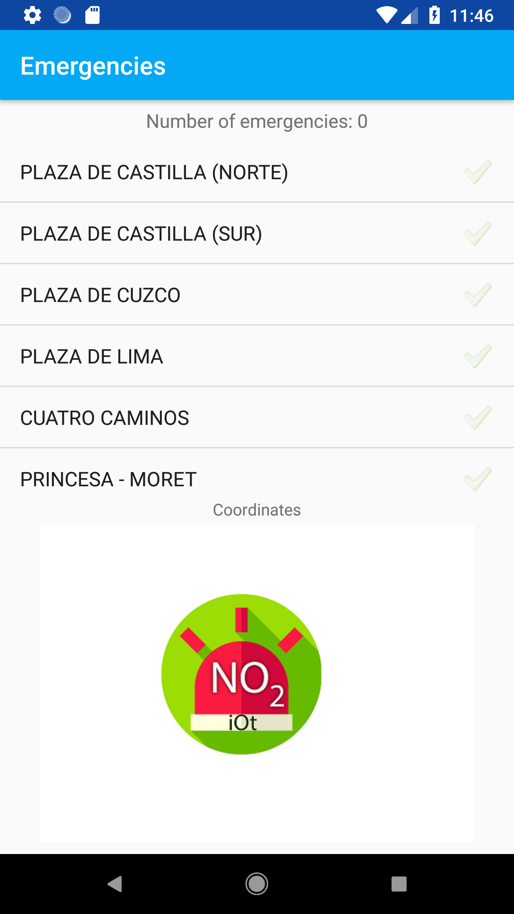
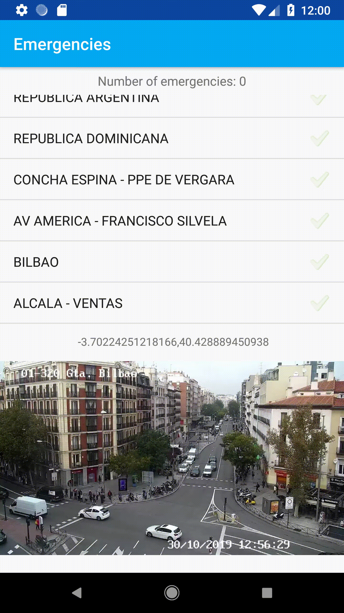

# Emergencies
This Android app is capable to store and show the data obtained by an emulated sensor in Madrid (Spain), using ThingSpeak channels to subscribe to, this data is about the level of NO2 in the zone. When a value greater than 100.0 is obtained, the app shows an alert in the list of the cameras.

Selecting the image shown above the list of the cameras, the app calculates which is the nearest camera location from the channel showing the alert and draws a route between the current position of the user and the location of the camera.

## App screenshoots

![When clic on a camera](visuals/clickOnCameraName.gif
